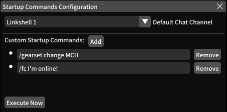

# FFXIV Startup Commands
An FFXIV plugin for performing custom commands and behaviors upon logging into a character.

Includes the option to change starting chat channel, because we're all tired of blasting Novice Net with personal messages by accident.

Requires [FFXIV Quick Launcher](https://github.com/goatcorp/FFXIVQuickLauncher)

## Usage
`/startup` in the chat box to bring up the configuration panel.

From here, you can select a default chat channel (None to keep FFXIV's default behavior), as well as enter custom chat commands.
Order of command execution cannot be guaranteed at the moment.

## Installation Instructions
* Open the plugin settings window by entering `/xlplugins` in the FFXIV chat window.
* Under the plugins list, click the "Settings" button.
* Go to the "Experimental" tab.
* Under the "Custom Plugin Repositories" section, add: https://raw.githubusercontent.com/SaltyCog/DalamudPlugins/main/repo.json
* Click the "+" button.
* Check the Enabled option.
* Click "Save and Close" at the bottom.
* Back at the plugins list, select the newly added plugins you wish to install/enable.

## Other Plugins
The Custom Plugin Repository you added in the above steps will give you access to any other plugins I happen to develop.
Don't worry, these aren't installed/enabled by default, and I'll always make the source code available so you can be reasonably sure
I'm not up to any sort of mischief.

Details on other plugins:
https://github.com/saltycog/DalamudPlugins

## Donations
**Ko-Fi:** https://ko-fi.com/saltycog
